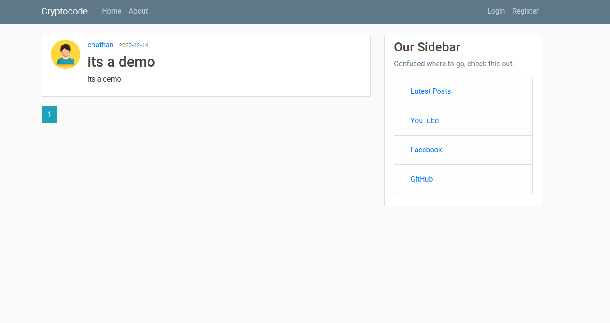
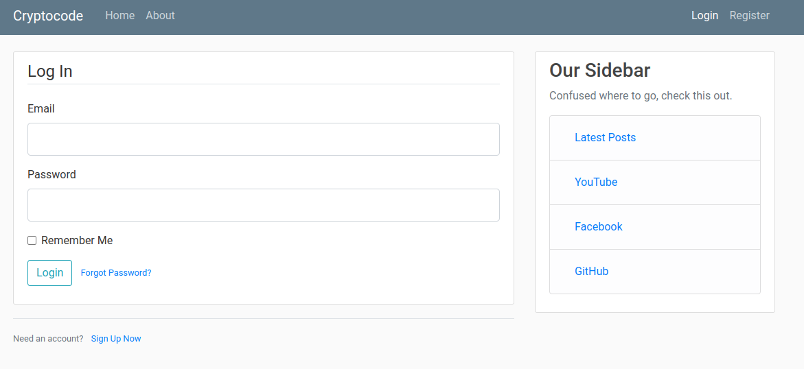
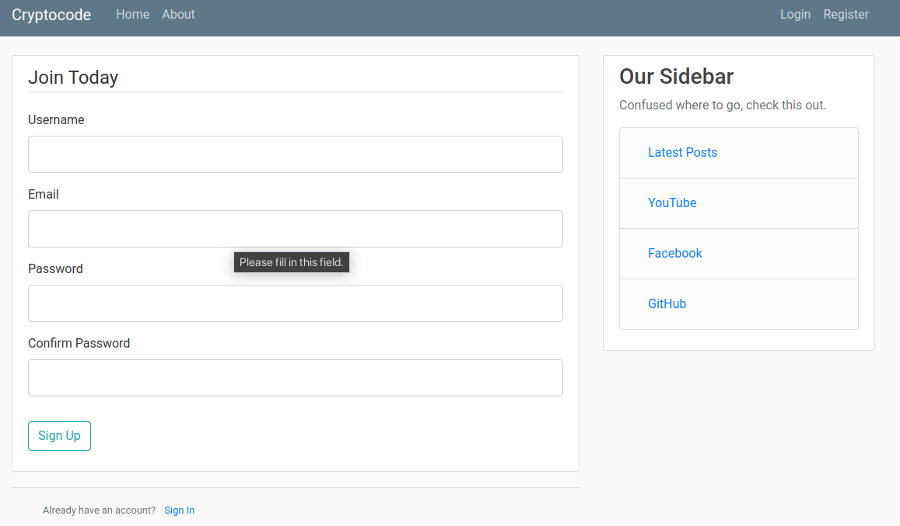

# BlogSite
Blog site, my college project created using python flask framework, HTML and CSS.

## Python related

You can use this for your educational purpose. It currently deployed in Heroku(its free) just visit [My App](https://mrchathan.herokuapp.com/) look around. 

You can run the application in two ways
1. Local Installation
2. Using Docker

## Local Installation

To run the scripts, you must have [python](https://www.python.org/downloads/) and [git](https://git-scm.com/downloads) properly installed in your machine. Then use these 5 simple commands to run the app.

1. `git clone https://github.com/PraneethGopinathan/BlogSite.git`  

2. `cd Blogsite` 

3. `pip install -r requirements.txt`  

4. `python main.py`  

## Docker setup
Make sure you installed the docker and docker compose (optional)

1. `git clone https://github.com/PraneethGopinathan/BlogSite.git`  

2. `cd Blogsite`

3. `docker build -t blogsite .`

4. `docker run -it -p 5000:5000 blogsite`

5. `Open http:0.0.0.0:5000 in the browser` 

### Docker Compose method 
Make sure you isntalled the docker compose
1. `docker compose up --build`
2. `Open http:0.0.0.0:5000 in the browser` 

Now enjoy the web app 😉.

Huh? 🤨 Wot dis? Click at your own risk!

## Screenshots
### Main Page

### Login Page

### Register Page

